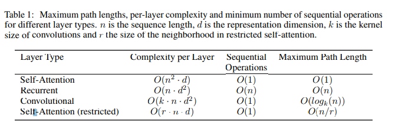
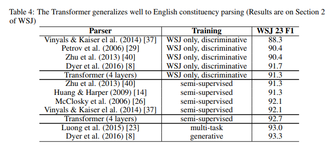

## 
Attention is all you need

### 
 摘要

目前序列转换模型都是完全基于R/CNN且都包含一个编码和一个解码部分。表现最好的模型也是通过attention机制将编码解码相连。我们提出一个新的简易网络结构Transformer，只基于attention机制完全摒弃了R/CNN结构。该模型在两个机器翻译任务上都表现出了高可平行性运算，明显缩短训练时长。模型在 2014 WMT 英德翻译任务中达到了28.4 BLEU分数，超过现有的最佳模型包括集成模型 2 BLEU。在 2014 WMT英法翻译任务中，我们的模型在单个模型中达到 state-of-the-art 分值 41.8 BLEU，训练使用8个GPU，时长3.5天。该模型具有良好的泛化能力，能够成功的应用在庞大以及受限的训练数据中。

### 1 介绍
- 尤其是LSTM、GRU等RNN网络已经确定在语言模型和机器翻译等序列模型和转换任务中达到state-of-the-art的表现。目前，许多努力仍在推动循环语言模型与编码-解码的架构的界限。  
- 循环模型通常是根据输入输出序列的符号位置进行因子计算的。该模型根据前一个隐形状态$h_1$以及输入的位置$t$作为当前隐性状态$h$计算的输入以此在计算时对其位置与步骤。该固有序列特性阻碍了并行训练，这对于长序列输入非常重要，因为内存大小限制了批处理数据。目前研究已经通过分解技巧和条件计算在计算效率方面有了重要提升，且后者还提高了模型性能。但是，顺序计算的基本约束依然存在。  
- 在许多任务中，attention机制已经成为序列模型和转换模型中不可或缺的部分，它可以建模依赖关系而不考虑输入输出序列中的距离。大多数情况，attention机制都和循环网络一起使用。  
在Transformer中，模型架构避免避免循环结构且完全依赖于attention机制来构建输入输出的全局依赖关系。Transformer允许更多的并行化并且经过8片P100 GPU 至少训练12小时可以在翻译任务上达到新的state-of-the-art

### 2 背景

- 减少顺序计算的目标也是形成可扩展神经GPU、ByteNet和ConvS2S的基础，这些模型都使用了卷积神经网络作为基础模块为所有的输入输出位置并行计算隐性特征。在这些模型中，关联任意两个输入输出位置的信号所需的操作次数会随着位置之间的距离而增加，ConvS2S是线性增加，ByteNet是对数增加的。这使得学习远距离位置的依赖变得更加困难。在Transformer中，这种操作数会减少到一个固定常数次，尽管平均化attention权重位置会降低效果但是使用Multi-Head attention会将其抵消。  
- Self-attention(有时也称之为 intra-attention)是关联单个序列的不同位置以计算出序列的特征的attention机制，已经在包括阅读理解、摘要总结、文本蕴含和学习任务无关的句子表征任务中成功使用。  
端到端的记忆网络是基于循环attention机制而非序列对齐循环网络，其已经在简单的语言问答模型和语言建模任务中表现良好。  
- 据我们所知，Transformer是第一个仅依赖于self-attention机制来计算输入输出的表征而非使用序列对齐的循环神经网络或者卷积神经网络。在一下章节中，将描述Transformer、self-attention并讨论其优点。  

### 3 模型结构

> 大多数序列转换模型都有编码-解码结构.
编码器映射一个用符号表示的输入序列
$(x_1,{\ldots},x_n)$ 到一个连续的表示$z= (z_1,{\ldots},z_n)$。 根据z，解码器生成符号的一个输出序列$(y_1,...,y_m)$ ，一次一个元素。 在每一步中，模型都是自回归的，当生成下一个时，消耗先前生成的符号作为额外输入。
Transformer遵循这种整体架构，编码器和解码器都使用`self-attention堆叠`和`point-wise`、全连接的层,分别显示在上图左右。

#### 3.1 编码与解码堆叠

> - 编码器： 编码器由N = 6 个完全相同的层堆叠而成。每一层都有两个子层。 第一层是一个`multi-head self-attention`机制，第二层是一个简单的全连接的前馈网络。 我们对每个子层再采用一个残差连接 ，后接层归一化。  
也就是说，每个子层的输出是`LayerNorm(x + Sublayer(x))`，其中`Sublayer(x)` 是由子层本身实现的函数。 为了方便这些残差连接，模型中的所有子层以及词0嵌入层的维度都为$d_{model} = 512$。
> - 解码器： 解码器同样由N = 6 个完全相同的层堆叠而成。 除了每个编码器层中的两个子层之外，解码器还插入第三个子层，对编码栈的输出执行`multi-head attention`。  
与编码器类似，我们在每个子层再采用残差连接，然后进行层归一化。 我们还修改解码器中的`self-attention`子层，以防止影响到后面的位置。 这种`mask multi-head self-attention`将输出的词嵌入偏移一个位置，确保对位置的预测$i$只能依赖小于$i$ 的已知输出。

#### 3.2 Attention
> Attention函数可以描述为将`query`和一组`key-value`对映射到输出，其中`query`、`key`、`value`和输出都是向量。 输出为`value`的加权和，其中分配给每个`value`的权重通过`query`与相应`key`的兼容函数来计算。

##### 3.2.1 缩放版的点积attention

+ 我们将我们特殊的attention称为`缩放点积attention`。 输入由`query`、 $d_k$  维的`key`和 $d_v$ 维的`value`组成。 我们计算`query`和所有`key`的点积并除以 $\sqrt{d_{k}}$，然后应用`softmax`函数以获得值的权重。
+ 在实践中，我们同时计算一组`query`的attention函数，并将它们组合成一个矩阵Q。 `key`和`value`也一起打包成矩阵 K 和 V 。 我们计算输出矩阵为

$$Attention(Q,K,V) = softmax(\frac {{QK}^T} {\sqrt{d_k}})V$$

+ 两个最常用的attention函数是加法attention和点积attention。除了缩放因子 $\frac{1}{\sqrt{d_{k}}}$ 之外，点积attention与我们的算法相同。 `加法attention`使用具有单个隐藏层的前馈网络计算兼容性函数。 虽然两者在理论上的复杂性相似，但在实践中`点积attention`使用高度优化的矩阵乘法代码，其速度更快、更节省空间
+ 当$d_k$的值比较小的时候，这两个机制的性能相差相近，当$d_k$比较大时，加法attention比不带缩放的`点积attention`性能好。 我们怀疑，对于很大的dk值，点积大幅度增长，将softmax函数推向具有极小梯度的区域4。 为了抵消这种影响，我们缩小点积 $\frac{1}{\sqrt{d_{k}}} $ 倍。

##### 3.2.2 Multi-Head Attention

+ 我们发现，在执行`Attention`函数时，将`query`,`key`,`value`通过学习到的线性变换h次得到的$d_k$,$d_k$,$d_v$维将比$d_{model}$维效果更好。且针对每种变换并行执行Attention函数得到$d_v$维的输出值，在将其连接并再次变换产生最终结果。
+ `multi-head attention`允许模型考虑不同位置的不同特征子空间的信息，如果只有一个Attention head ，做平均化时会削弱结果。
$$
\begin{align}
MultiHead(Q,K,V) =& Concat(head_1,{\ldots},head_h)W^O \\
where head_i =& Attention(QW^Q_i,KW_i^K,VW^V_i)
\end{align}
$$
其中,$W^Q_i\in R^{d_{model}xd_k}$,$W^K_i\in R^{d_{model}xd_k}$,$W^V_i\in R^{d_{model}xd_v}$,$W^O\in R^{hd_v*d_{model}}$  
本文中我们并行计算八层Attention。每一层使用的参数$d_k=d_v=d_{model}/h=64$。由于每层大小减小，总计算成本与具体全部纬度的单层Attention相似

##### 3.2.3 Attention在模型中的应用
> Transformer通过三种方式使用`multi-head attention`
> + 在编码解码层中，`queries`来自于前一层的解码层，且`keys` 和`values`来自于前一层编码层的输出。这模仿在Seq2Seq模型中典型的编码-解码Attention机制  
> + 编码器包含`self-attention`层。该层中`keys，values,queries`都来自于同一个地方，在这里是前一层编码器。编码器的每一个位置都能关注上一层编码器的所有位置。
> + 同样的，解码器的`self-attention`层的每一个位置都能关注上一层解码器的所有位置。我们需要阻止解码器中左向信息流来保持自回归性。我们通过屏蔽softmax输入中所有不合法的值(设置为-$\infty$)来实现缩放点积Attention。

#### 3.3 基于位置的前馈网络
除了`attention`子层之外，我们的编码-解码器中的每个层都包含一个全连接前馈网络，该前馈网络单独且相同地应用于每个位置。 它由两个线性变换组成，之间有一个ReLU激活。  
$$FFN(x) = max(0, xW_1 + b_1)W_2 + b_2$$

尽管线性变换在不同位置上是相同的，但在层与层之间使用不同参数，也可以称之为是两个内核大小为1的卷积。 输入和输出的维度为$d_{model} = 512$，内部层的维度为$d_{ff} = 2048$。

####3.4 嵌入和Softmax
与其他序列转导模型类似，我们使用学习到的词嵌入向量将输入输出词符转换为维度为$d_{model}的向量。 我们还使用普通的线性变换和softmax函数将解码器输出转换为下一个词符的预测概率。  

在我们的模型中，两个嵌入层之间和`pre-softmax`线性变换共享相同的权重矩阵。 在嵌入层中，我们将这些权重乘以 $\sqrt{d_{model}}$ 。

#### 3.5 位置编码
由于我们的模型不包含循环和卷积部分，为了让模型利用序列的顺序，我们必须注入序列中关于词符相对或者绝对位置信息。 为此，我们将``位置编码``添加到编码-解码器栈底的输入词向量中。 因为位置编码和词向量的维度相同，所以它们俩可以相加。 有多种位置编码可以选择，例如通过学习得到的位置编码和固定位置编码。

在本文中，我们使用不同频率的正弦和余弦函数：
$$
\begin{align}
PE_{(pos,2i)} =& sin(pos∕10000^{2i ∕ d_{model}}) \\
PE_{(pos,2i+1)} =& cos(pos∕10000^{2i ∕ d_{model}})
\end{align}
$$

其中pos 是位置，i 是维度。 也就是说，位置编码的每个维度对应于一个正弦曲线。 这些波长形成一个(2π ,10000*2π)的 几何级数。 我们选择这个函数是因为我们假设它允许模型很容易学习对相对位置的`Attention`，因为对任意确定的偏移k, $PE_{pos+k}$ 可以表示为 $PE_{pos}$ 的线性函数。

我们还使用学习到的位置嵌入进行了试验，发现这两个版本产生几乎相同的结果。 我们选择了正弦曲线，因为它可以允许模型推断比训练数据更长的序列。

### 4 为什么选择Self-Attention
> 本节，我们比较`self-attention`与循环、卷积层的各个方面，它们通常用于将变长的符号序列表示 $(x_1,...,x_n)$ 映射 到另一个等长的序列 $(z_1,...,z_n)$ ，其中 $x_i,z_i \in ℝ^d$ ，例如一个典型的序列转导编码-解码器中的隐藏层。  
我们使用`self-attention`是考虑需要解决三个问题。

> + 1、每层计算的总复杂度。
> + 2、可并行的计算量，以所需的最小顺序操作的数量来衡量。
> + 3、网络中长距离依赖之间的路径长度。

学习长距离依赖性是许多序列转导任务中的关键挑战。 影响学习这种依赖性能力的一个关键因素是前向和后向信号必须在网络中传播的路径长度。 输入和输出序列中任意位置组合之间的上述路径越短，学习远距离依赖就越容易。因此，我们还比较了由不同图层类型组成的网络中任意两个输入和输出位置之间的最大路径长度。

> 表1： 不同图层类型的最大路径长度、每层复杂度和最少顺序操作数。 n 为序列的长度，d 为表示的维度，k 为卷积的核的大小，r 为受限`self-attention`中邻域的大小。

+ 如表1所示，`self-attention`层将所有位置连接到恒定数量的顺序执行的操作，而循环层需要复杂度 $O(n)$ 顺序操作。 在计算复杂性方面，当序列长度 n 小于特征维度d 时，`self-attention`层比循环层快，这是机器翻译中最先进的模型中最常见的情况，例如`word-piece`和`byte-pair`。为了提高涉及很长的序列任务的计算性能，可以将`self-attention`限制在仅考虑大小为 $r$ 的邻域。 这会将最大路径长度增加到$O(n∕r)$。 我们计划在未来的工作中进一步调查这种方法。

+ 核大小 $k < n$ 的单层卷积不会连接每一对输入和输出的位置。 这种做法在邻近核的情况下需要 $O(n∕k)$ 个卷积层， 在扩展卷积的情况下需要 $O(log_k(n))$ 个层，它们增加了网络中任意两个位置之间的最长路径的长度。 卷积层通常比循环层计算代价更昂贵，与因子k有关。然而，可分卷积将复杂度大幅减少到 $O(k ⋅n⋅d + n⋅d^2)$。 然而即使 $k = n$，一个可分卷积的复杂度等同于`self-attention`层和`point-wise`前向层的组合，即我们的模型采用的方法。

+ 有一个间接好处是`self-attention`可以产生更可解释的模型。 我们从我们的模型中研究`attention`的分布，并在附录中展示和讨论示例。 每个`attention head`不仅清楚地学习到执行不同的任务，许多似乎展现了句子的句法和语义结构的行为。

## 训练

本章节主要描述模型训练方法

### 5.1 训练数据和批次

我们的训练数据是2014WMT英德翻译数据集中的450w对数据。句子使用`byte-pair`编码，使用了开源的37000大小的词典。在英法翻译中我们使用更大的2014WMT英法数据集，有3600w对数据，切分成32000大小的词表。句子对根据相似长度分批次。每批训练数据包括25000原数据与对应的目标数据。

### 5.2 硬件和时间

我们在8片NVIDIA P100上训练数据。使用本文描述的超参的模型每步大约花0.4s。共花12h训练了100000步。对于我们的较大的模型，每步花1.0s，需要3.5d训练300000步

### 5.3 优化

我们使用了`Adam`优化方法，参数 $\beta_!=0.9,\beta_2=0.98,\epsilon=10^{-9}$。根据以下公式更新学习率
$$lrate = d^{−0.5}_{model} · min(step_num−0.5, step_num · warmup_steps−1.5)$$
这对应到第一次`warmup_steps`步骤中线性增加学习率并且最后根据步数的平方减小。我们使用的`warmup_steps`=4000.

### 正则化

> 我们在训练中使用了三种方式的正则  

`Residual Dropout`
> + 我们在每一个子层输出时且在在做加法和归一化之前添加`dropout`。
> + 另外我们在所有编码-解码栈的词向量和位置编码求和时加入`dropout`。对于基础模型，$P_{drop}=0.1$

`label Smoothing`  
> + 在训练过程中，$\epsilon_{ls}=0.1$。这让模型更加难以理解，使模型学习不稳定但是提高了`BLEU`分数。

## 6 结果

### 6.1 机器翻译

- 在2014WMT英-语翻译任务中，大型Transformer模型比以前报道的最佳模型（包括集成模型）高出2.0个BLEU以上，确立了一个全新的最高BLEU分数为28.4。 该模型的配置列在表3的底部。在8 个P100 GPU上训练3.5 天。 即使我们的基础模型也超过了以前发布的所有模型和集成模型，且训练成本只是这些模型的一小部分。

- 在2014WMT英法翻译任务中，我们的大型模型的BLEU得分为41.0，超过了之前发布的所有单一模型，训练成本低于先前最先进模型的1 ∕ 4 。 英法的Transformer (big) 模型使用丢弃率为 $P_{drop} = 0.1$，而不是0.3。

- 对于基础模型，我们使用的单个模型是来自最后5个检查点的平均值，这些检查点每10分钟写一次。 对于大型模型，我们对最后20个检查点进行了平均。 我们使用`beam search`，`beam`大小为4 ，长度惩罚α = 0.6。 这些超参数是在开发集上进行实验后选定的。 在推理时，我们设置最大输出长度为输入长度+50，但在可能时尽早终止。

- 表2总结了我们的结果，并将我们的翻译质量和训练成本与文献中的其他模型体系结构进行了比较。 我们通过将训练时间、所使用的GPU的数量以及每个GPU的持续单精度浮点能力的估计相乘来估计用于训练模型的浮点数操作数量。

### 6.2 模型变体

+ 为了评估`Transformer`不同组件的重要性，我们以不同的方式改变我们的基础模型，并在开发集`newstest2013`英德翻译任务上测量性能变化。我们使用前一节所述的`beamn search`，但没有平均化检查点。 我们在表中列出这些结果 3.

+ 在表3的行（A）中，我们改变`attention head`的数量和`attention key`和`value`的维度，保持计算量不变，如3.2.2节所述。 虽然只有一个`head` `attention`比最佳设置差0.9 BLEU，但质量也随着`head`太多而下降。

+ 在表3行（B）中，我们观察到减小`key`的大小$d_k$会有损模型质量。 这表明确定兼容性函数并不容易，并且比点积更复杂的兼容性函数可能更有用。我们在行（C）和（D）中进一步观察到，如预期的那样，更大的模型更好，并且`dropout`对避免过拟合非常有帮助。 在行（E）中，我们用学习到的位置嵌入来替换我们的正弦位置编码，并观察到与基本模型几乎相同的结果。

### 6.3 英语选区解析

+ 为了评价`Transformer`在其他任务的泛化程度，我们在` English
constituency parsing`任务上尝试。 这项任务特别的挑战是输出受到很强的结构性约束，并且比输入要长很多。 此外，RNN`Seq2Seq`模型还没有能够在小数据中获得最好的结果。

+ 我们用$d_{model} = 1024$ 在`Penn Treebank`的`Wall Street Journal（WSJ）`部分训练了一个4层`transformer`，约40K个训练句子。 我们还使用更大的高置信度和`BerkleyParser`语料库，在半监督环境中对其进行训练，大约17M个句子。 我们使用了一个16K大小的词汇表作为WSJ唯一设置，和一个32K大小词汇表用于半监督设置。

+ 我们只做了少量的实验去调整了`attention`和`residual`上使用`dropout`，也使用上述开发集中的`learning rate`和`beam size`，其他所有参数都和英德翻译模型中保持一致。在推理过程中，我们将最大输出长度增加到输入长度+300。 对于WSJ和半监督设置，我们都使用`beam`=21 和 α = 0.3 。

- 表4中我们的结果表明，尽管缺少特定任务的调优，我们的模型表现得非常好，得到的结果比之前报告的除循环神经网络语法之外的所有模型都好。

+ 与RNN`Seq2Seq`模型相比，即使仅训练WSJ 40K对句子时，`Transformer`也胜过`BerkeleyParser`。

## 7 结论
- 在这项工作中，我们提出了Transformer，第一个完全基于`attention`的序列转换模型，用`multi-headed self-attention`取代了编码解码器架构中最常用的循环层。

- 对于翻译任务，`Transformer`可以比基于循环或卷积层的体系结构训练更快。 在WMT 2014英德和WMT 2014英法翻译任务中，我们取得了最好的结果。 我们最好的模型甚至胜过以前报道过的所有集成模型。

- 我们对基于`attention`模型的未来感到兴奋，并计划将它们应用于其他任务。 我们计划将`Transformer`扩展到除文本之外的问题，并调查局部的、受限`attention`机制在处理大型输入和输出，如图像、音频和视频的表现。 我们的另一个研究目标是如何生成更少顺序计算的模型。

- 我们用于训练和评估模型的代码 https://github.com/tensorflow/tensor2tensor
